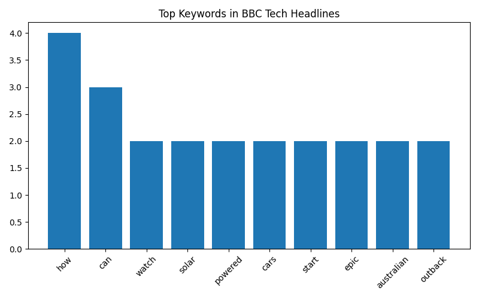

# 📰 Automated BBC Tech News Scraper with Charts & Scheduling

This project automates the process of scraping the latest **BBC
Technology News**, analyzing keywords, and generating reports with
visualizations.

## 📂 Project Files

-   `news_scraper_automation.py` → Python automation script
-   `news_report_20250824_styled.xlsx` → Example generated styled report
-   `keyword_chart.png` → Keyword frequency chart (auto-generated by
    script)

## ⚡ Features

-   Scrapes top 20 headlines from [BBC Technology
    News](https://www.bbc.com/news/technology)
-   Performs keyword frequency analysis
-   Generates a bar chart of top keywords
-   Exports results to Excel with **styling & embedded chart**
-   Automates scheduling (extendable with `schedule` library)

## 📊 Example Output

### Keyword Chart



### Excel Report Preview

The script saves a styled Excel file with two sheets: 1. **Headlines** →
Top 20 scraped headlines 2. **Keywords** → Keyword frequency analysis +
chart

📎 Example Report File: [Download
Here](news_report_20250824_styled.xlsx)

## 🚀 How to Run

``` bash
pip install -r requirements.txt
python news_scraper_automation.py
```

## 🛠️ Requirements

-   pandas
-   matplotlib
-   openpyxl
-   beautifulsoup4
-   requests

## 💡 Future Improvements

-   Add scheduling with `schedule` for daily automation
-   Extend scraper to multiple news categories
-   Push reports automatically to GitHub
